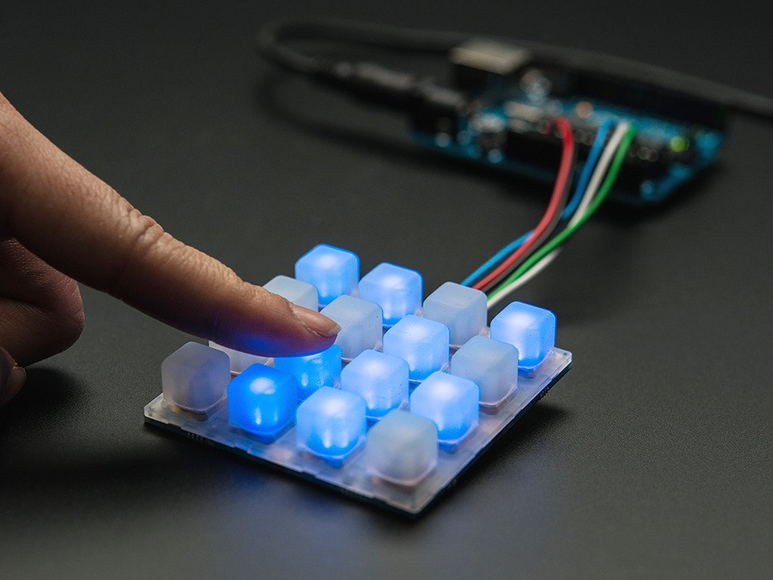

# Neotrellis

Neotrellis is a ruby driver for Adafruit's NeoTrellis keypad. This device uses an I2C bus to control both the keypad and the RGB led array.



See https://www.adafruit.com/product/3954 for more details on this device.

This ruby gem is mainly compose of two classes :
 - `Neotrellis::Neopixels` to control the leds behind each keys.
 - `Neotrellis::Keypad` to execute code when a key is pressed or released on the keypad.

The Keypad class provide two modes to react to key events: using pooling with a loop or using interruption handler. The pooling mode require only the I2C communication to be set up. For the interruption mode to work, the pin INT on the keypad need to be connected to a GPIO input supporting hardware interruption on your computer. A common use case are the pins 15 or 16 of the Raspberry Pi GPIO header. See Raspberry Pi documentation for more details.

The support of hardware interruptions is done by the [YaGPIO](https://github.com/nagius/ya_gpio) gem based on the Sysfs interface. It has been designed for Raspberry Pi but should work with any GPIO systems supported by the Sysfs kernel driver.

## Installation

Add this line to your application's Gemfile:

```ruby
gem 'neotrellis'
```

And then execute:

    $ bundle

Or install it yourself as:

    $ gem install neotrellis

## Usage

We will suppose here that you are using a Rasberry Pi B+ to control the Neotrellis device. Adapt the I2C device name and pin numbers for other boards.

First, connect the pins SDA and SLC of the keypad to GPIO pins 3 and 5. The device will appear on the second I2C bus of the Raspberry Pi `/dev/i2c-1`. The I2C port need to be enabled in the linux kernel to operate. Refer to Raspberry Pi documentation to do so.

If you want to use the interruption mode also connect the INT pin to the GPIO pin 15 (GPIO22).

### Example 1: Print a message when key #3 is pressed using polling

```ruby
seesaw = Neotrellis::Seesaw.new(device: "/dev/i2c-1", addr: 0x2E)
keypad = Neotrellis::Keypad.new(seesaw)
keypad.set_event(2, event: Neotrellis::Keypad::KEY_PRESSED) { |event|
    puts "Key #{event.key} pressed"
}
loop do 
    sleep(1)
    puts "Processing pending events"
    keypad.sync
end
```

### Example 2:  Print a message when key #3 is released using interruption

```ruby
seesaw = Neotrellis::Seesaw.new(device: "/dev/i2c-1", addr: 0x2E)
keypad = Neotrellis::Keypad.new(seesaw)
keypad.set_event(2, event: Neotrellis::Keypad::KEY_RELEASED) { |event|
    puts "Key #{event.key}"
    puts event.edge == Neotrellis::Keypad::KEY_PRESSED ? "pressed" : "released"
}
keypad.enable_interrupt(22)
keypad.wait_for_event
```

### Example 3: Turn on led #2 in red for 2 seconds

```ruby
seesaw = Neotrellis::Seesaw.new(device: "/dev/i2c-1", addr: 0x2E)
pixels = Neotrellis::Neopixel.new(seesaw)
pixels.set(1, Neotrellis::Neopixel::RED)
sleep 2
pixels.set(1, Neotrellis::Neopixel::OFF)
```

### Example 4: Turn on the pressed key with a random color

```ruby
seesaw = Neotrellis::Seesaw.new(device: "/dev/i2c-1", addr: 0x2E)
keypad = Neotrellis::Keypad.new(seesaw, interrupt_pin: 22)
pixels = Neotrellis::Neopixel.new(seesaw)

Neotrellis::Neopixel::DEFAULT_PIXEL_NUMBER.times do |key|
  keypad.set_event(key) do |event|
    if event.edge == Neotrellis::Keypad::KEY_PRESSED
      pixels.set(event.key, Neotrellis::Neopixel::Color.new(rand(255), rand(255), rand(255)))
    else
      pixels.set(event.key, Neotrellis::Neopixel::OFF)
    end
  end
end
keypad.wait_for_event
```

### API documentation

The API documentation is available in the Yard format. To generate it under the `doc` directory, run :

```
bundle exec rake yard
```

## Contributing

Bug reports and pull requests are welcome on GitHub at https://github.com/nagius/neotrellis.

## License

Copyleft 2019 - Nicolas AGIUS - GNU GPLv3

